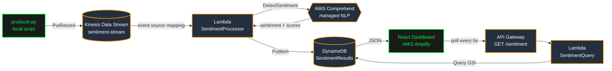

# Real-Time Sentiment Dashboard

A serverless, event-driven NLP pipeline on AWS that ingests streaming text, classifies its sentiment in real time using AWS Comprehend, and visualises the results on a live React dashboard.

## Architecture



> Provisioned via [`template.yaml`](template.yaml) (AWS SAM) — `sam deploy --guided` brings up the whole stack.

## AWS Services

| Service              | Purpose                              |
| -------------------- | ------------------------------------ |
| Kinesis Data Streams | Real-time text ingestion             |
| Lambda × 2           | Stream processing + API query        |
| AWS Comprehend       | Managed NLP sentiment classification |
| DynamoDB             | NoSQL result storage                 |
| API Gateway          | REST endpoint for the dashboard      |
| Amplify              | React frontend hosting               |

## Project Structure

```
.
├── template.yaml             # AWS SAM — provisions Kinesis, DynamoDB, Lambdas, API Gateway
├── lambda_function.py        # Stream processor — deployed as SentimentProcessor
├── api_handler.py            # API query handler — deployed as SentimentQuery
├── producer.py               # Local Kinesis producer (run with `python producer.py`)
├── requirements.txt          # Pinned Python deps for the producer
├── docs/build-plan.md        # Original 3-week build plan + interview notes
└── sentiment-dashboard/      # React dashboard (Create React App)
    ├── src/
    │   ├── App.js                            # Composition root — wires components together
    │   ├── theme.js                          # Shared colours, fonts, panel styles
    │   ├── hooks/useSentimentData.js         # Fetch + 5s polling with cleanup
    │   └── components/
    │       ├── Header.jsx                    # Title bar + [LIVE] indicator
    │       ├── Marquee.jsx                   # Scrolling ticker
    │       ├── StatCards.jsx                 # POSITIVE/NEGATIVE/NEUTRAL/MIXED counters
    │       ├── SentimentPieChart.jsx         # Breakdown donut + legend
    │       ├── SentimentTimeline.jsx         # Confidence scores over time
    │       └── LiveFeed.jsx                  # Latest records list
    ├── .env.local                            # Local env vars (gitignored)
    └── package.json
```

## Quick Start

### 1. Prerequisites

```bash
pip install -r requirements.txt
aws configure   # set your IAM credentials and default region
```

### 2. Deploy the Stack (AWS SAM)

The entire pipeline — Kinesis stream, DynamoDB table, both Lambdas, the Kinesis event source mapping, and the API Gateway endpoint — is defined in [`template.yaml`](template.yaml). One command brings it all up:

```bash
sam build
sam deploy --guided    # first time only; saves config to samconfig.toml
```

Deploy outputs include `ApiUrl` — paste this into `sentiment-dashboard/.env.local` as `REACT_APP_API_URL`.

<details>
<summary>Manual CLI alternative (no SAM)</summary>

```bash
# Kinesis stream
aws kinesis create-stream --stream-name sentiment-stream --shard-count 1

# DynamoDB table
aws dynamodb create-table \
  --table-name SentimentResults \
  --attribute-definitions AttributeName=id,AttributeType=S \
  --key-schema AttributeName=id,KeyType=HASH \
  --billing-mode PAY_PER_REQUEST
```

Then manually create the two Lambdas, wire `SentimentProcessor` to Kinesis via an event source mapping, and put `SentimentQuery` behind an API Gateway `GET /sentiment` route with CORS enabled.
</details>

Both handlers read the region from the `AWS_REGION` environment variable. Lambda sets this automatically, so no manual config is required.

### 3. Run the Producer

```bash
python producer.py
```

This streams simulated reviews into Kinesis every 2 seconds until you Ctrl+C.

### 4. Run the Dashboard

```bash
cd sentiment-dashboard
echo "REACT_APP_API_URL=https://<your-api-id>.execute-api.<region>.amazonaws.com/prod/sentiment" > .env.local
npm install
npm start
```

The dashboard polls the API every 5 seconds and re-renders as new records arrive.

## Configuration

All deployable code reads configuration from environment variables — no values are hardcoded.

### Python (Lambda + producer)

| Variable     | Default     | Notes                                                |
| ------------ | ----------- | ---------------------------------------------------- |
| `AWS_REGION` | `us-east-1` | Lambda sets this automatically; only matters locally |

### React (Vite)

| Variable         | Required | Notes                                                                              |
| ---------------- | -------- | ---------------------------------------------------------------------------------- |
| `VITE_API_URL`   | yes      | Full API Gateway endpoint URL. Set in `.env.local` locally; set in Amplify for prod |

Vite only reads env files at startup — restart `npm run dev` after editing `.env.local`.

## IAM Policy (Least Privilege)

Attach to the Lambda execution role:

```json
{
  "Version": "2012-10-17",
  "Statement": [
    {
      "Effect": "Allow",
      "Action": [
        "comprehend:DetectSentiment",
        "dynamodb:PutItem",
        "dynamodb:Query",
        "kinesis:GetRecords",
        "kinesis:GetShardIterator",
        "kinesis:DescribeStream",
        "kinesis:ListShards",
        "logs:CreateLogGroup",
        "logs:CreateLogStream",
        "logs:PutLogEvents"
      ],
      "Resource": "*"
    }
  ]
}
```

## DynamoDB Schema

```json
{
  "id": "uuid-v4",
  "bucket": "ALL",
  "text": "Original input text",
  "sentiment": "POSITIVE",
  "scores": {
    "Positive": "0.9412",
    "Negative": "0.0203",
    "Neutral":  "0.0312",
    "Mixed":    "0.0073"
  },
  "source": "simulated-review",
  "timestamp": "2026-05-13T10:30:00Z"
}
```

- **Primary key:** `id` (UUID, carried through from the producer for idempotency on Kinesis retries).
- **GSI `ByTimestamp`:** `bucket` (HASH) + `timestamp` (RANGE). Enables the API to `Query` for the latest N records in bounded RCUs — the original `Scan` was O(table-size). The constant `bucket = "ALL"` is a deliberate demo simplification; at production write volume this would need to be sharded (e.g. `hash(id) % N`) to avoid a hot partition.
- **Scores** are stored as strings to preserve DynamoDB number precision; the query Lambda converts them back to floats for the JSON response.

## Cost (Demo Scale)

Designed to fit comfortably inside the AWS Free Tier at demo / interview scale:

- **Kinesis** — 1 shard (free for 12 months)
- **Comprehend** — ~500 units/session (50K free/month)
- **Lambda** — negligible (1M free requests/month)
- **DynamoDB** — `PAY_PER_REQUEST`, well below free-tier thresholds
- **Amplify** — free build minutes sufficient
