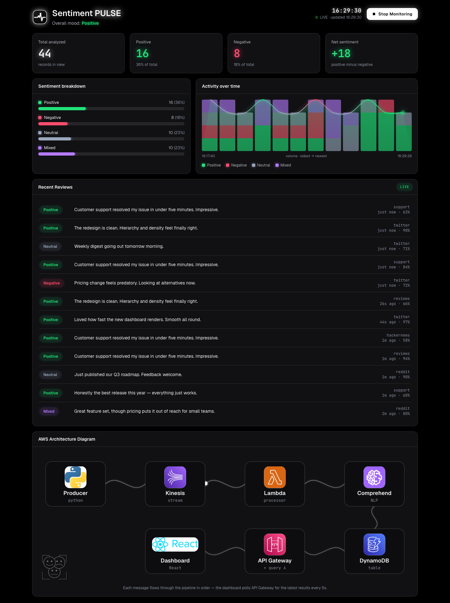
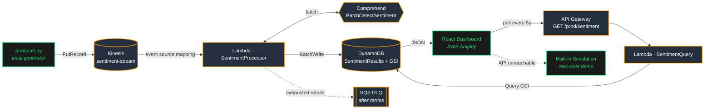

# Sentiment PULSE — Real-Time Sentiment Dashboard

A serverless, event-driven NLP pipeline on AWS that ingests streaming text, classifies its sentiment in real time with **AWS Comprehend**, and visualises the results on a live **React** dashboard.

**▶ Live demo:** https://master.d1vwgts5qfrat7.amplifyapp.com
*(The AWS backend is torn down between demos to keep costs at $0, so the live site runs on the built-in simulation — see [Cost & teardown](#cost--teardown). The full pipeline is deployable in one command with AWS SAM.)*



---

## Highlights

- **End-to-end streaming pipeline** — Kinesis → Lambda → Comprehend → DynamoDB → API Gateway → React, provisioned as infrastructure-as-code with AWS SAM.
- **Reliable by design** — idempotent writes, **batched** Comprehend calls, **partial-batch-response** retries, and an **SQS dead-letter queue** so no record is silently lost.
- **Cost-aware** — one `sam delete` returns the backend to $0; the dashboard automatically falls back to a built-in simulation, so the demo is always available for free.
- **Polished, accessible UI** — jet-black glow theme, a mood-coloured activity curve, an animated AWS architecture diagram, responsive layout, relative timestamps, and `prefers-reduced-motion` / keyboard-modal support.
- **Tested & CI'd** — 21 frontend tests (Vitest) + 8 backend tests (pytest + moto), both run on every push via GitHub Actions.

## Architecture



### How it works

**Write path (ingestion).** `producer.py` streams fake reviews into the Kinesis stream. A Kinesis event-source mapping invokes `SentimentProcessor` in batches; it calls Comprehend's `BatchDetectSentiment` (one call per batch instead of one per record) and writes results to DynamoDB via a batch writer. The producer's UUID is used as the DynamoDB partition key, so Kinesis retries are **idempotent**. Any records that fail are returned as `batchItemFailures` (partial batch response) and retried; batches that exhaust retries are routed to an **SQS DLQ** rather than dropped.

**Read path (query).** The dashboard polls `GET /prod/sentiment` every 5s. `SentimentQuery` runs a bounded `Query` against the `ByTimestamp` GSI (latest N, newest-first) — never a full-table `Scan` — and returns JSON with permissive CORS.

**Resilience.** If the API is unreachable (e.g. the backend is deleted), the dashboard silently switches to a client-side simulation so it always renders a live-looking demo.

## Tech stack

| Layer      | Tech |
| ---------- | ---- |
| Ingestion  | Amazon Kinesis Data Streams |
| Compute    | AWS Lambda × 2 (Python 3.13) |
| NLP        | Amazon Comprehend (`BatchDetectSentiment`) |
| Storage    | Amazon DynamoDB (on-demand, GSI) |
| Reliability| SQS dead-letter queue + partial batch response |
| API        | Amazon API Gateway (REST) |
| Frontend   | React 19 + Vite 6, hand-drawn SVG charts (no chart lib) |
| Hosting    | AWS Amplify |
| IaC        | AWS SAM (`template.yaml`) |
| CI         | GitHub Actions (Vitest + pytest/moto) |

## Project structure

```
.
├── template.yaml              # AWS SAM — Kinesis, DynamoDB, Lambdas, API Gateway, SQS DLQ
├── samconfig.toml             # Saved deploy config
├── .samignore                 # Keeps non-Lambda files out of the deploy package
├── backend/
│   ├── lambda_function.py     # SentimentProcessor — stream → Comprehend → DynamoDB
│   ├── api_handler.py         # SentimentQuery — API Gateway → GSI query
│   ├── conftest.py            # pytest fixtures (moto-mocked DynamoDB)
│   ├── test_lambda_function.py
│   └── test_api_handler.py
├── producer.py                # Local Kinesis producer (python producer.py)
├── requirements.txt           # Producer deps (boto3, faker)
├── requirements-dev.txt       # Test deps (pytest, moto)
├── docs/                      # Screenshot + original build plan
└── sentiment-dashboard/       # Vite + React 19 frontend
    ├── src/
    │   ├── App.jsx            # Single-file dashboard (UI + charts + simulation)
    │   └── App.test.jsx       # Vitest unit tests for the pure helpers
    ├── public/                # Pulse logo + trimmed AWS service icons
    └── amplify.yml            # Amplify build spec
```

## Run the dashboard locally

The frontend works **with or without** a backend — no AWS needed to see it:

```bash
cd sentiment-dashboard
npm install
npm run dev        # http://localhost:3000
```

With no `VITE_API_URL` set it starts in **simulation** mode. To point it at a live API, add `sentiment-dashboard/.env.local`:

```
VITE_API_URL=https://<api-id>.execute-api.us-east-1.amazonaws.com/prod/sentiment
```

> Vite reads env files at startup — restart `npm run dev` after editing `.env.local`.

## Deploy the backend (AWS SAM)

The whole pipeline is one template:

```bash
pip install -r requirements.txt        # producer deps
sam build && sam deploy                 # first run: sam deploy --guided

# grab the API URL from the stack outputs
aws cloudformation describe-stacks --stack-name sentiment-dashboard \
  --query "Stacks[0].Outputs[?OutputKey=='ApiUrl'].OutputValue" --output text

python producer.py                      # stream data in (Ctrl+C to stop)
```

Set the printed `ApiUrl` as `VITE_API_URL` in `.env.local` (local) and in the Amplify env vars (prod), then rebuild the frontend to connect it to live data.

## Tests

```bash
# Frontend (21 tests)
cd sentiment-dashboard && npm test

# Backend (8 tests — pytest + moto, mocked DynamoDB / stubbed Comprehend)
pip install -r requirements-dev.txt && pytest backend
```

Both suites run automatically on every push/PR via [`.github/workflows/ci.yml`](.github/workflows/ci.yml).

## Cost & teardown

The only meaningful ongoing cost is the **Kinesis shard (~$11/month, billed 24/7 whether or not data flows)** — Kinesis Data Streams has no perpetual free tier. Comprehend is billed per document, only while the producer runs; Lambda / DynamoDB / API Gateway are effectively free at demo scale.

So the workflow is **deploy on demand, delete when idle**:

```bash
sam delete     # removes Kinesis, Lambdas, DynamoDB, API Gateway, DLQ → $0
```

After teardown the Amplify site keeps working via the simulation fallback, so the demo is always available at no cost. To go live again: `sam build && sam deploy`, then re-point `VITE_API_URL` (the API URL changes on each recreate) and run the producer.

## Design decisions

- **GSI over Scan.** A single-partition (`bucket = "ALL"`) + `timestamp` GSI turns "latest N records" into a bounded `Query`. The constant partition is a deliberate demo simplification; at production write volume it would be sharded (`hash(id) % N`) to avoid a hot partition.
- **Idempotency.** Carrying the producer's UUID as the DynamoDB key makes Kinesis's at-least-once retries safe to reprocess.
- **Partial batch response + DLQ.** The handler returns only the failed records' sequence numbers, so successful ones are checkpointed and only failures retry — then land in the DLQ instead of being lost.
- **Batched Comprehend.** One `BatchDetectSentiment` per Lambda invocation instead of one call per record cuts API calls and Lambda duration.
- **No chart library.** Every chart and the architecture diagram are hand-drawn SVG — small bundle, full control over the animated, mood-coloured visuals.

## DynamoDB schema

```json
{
  "id": "uuid-v4",                 // partition key (carried from producer → idempotent)
  "bucket": "ALL",                 // GSI partition key
  "timestamp": "2026-05-13T10:30:00Z",  // GSI sort key
  "text": "Original input text",
  "sentiment": "POSITIVE",
  "scores": { "Positive": "0.9412", "Negative": "0.0203", "Neutral": "0.0312", "Mixed": "0.0073" },
  "source": "simulated-review"
}
```

Scores are stored as strings to preserve DynamoDB number precision; `SentimentQuery` converts them back to floats in the JSON response. IAM is least-privilege via SAM policies (`DynamoDBCrudPolicy`, `DynamoDBReadPolicy`, `SQSSendMessagePolicy`) plus a scoped `comprehend:BatchDetectSentiment` statement.
